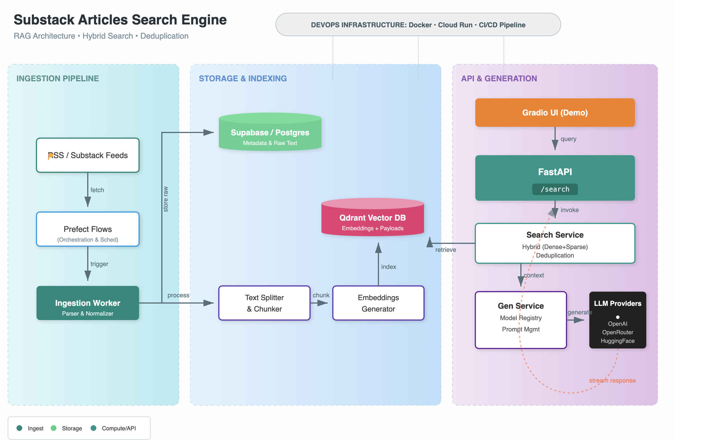

# Substack Articles Search Engine


<div align="center">

[]
[](https://opensource.org/licenses/MIT)
[](https://www.python.org/)

</div>

A production-ready Retrieval-Augmented Generation (RAG) project that lets you index, search, and answer questions over Substack (RSS) newsletter articles using semantic search and LLMs.

This repository contains a complete backend for ingestion, indexing, search, and answer generation. It is designed for developers and teams who want a working RAG stack with real-world integrations (Qdrant, Supabase, Prefect, FastAPI) and multi-provider LLM support.

**Goals:**
- Provide a robust pipeline to ingest and store newsletter articles.
- Generate and index embeddings for semantic search.
- Offer REST APIs and an optional Gradio UI for search and question answering.
- Support multiple LLM providers and streaming/non-streaming responses.

**Quick links:**
- FastAPI entry: `src/api/main.py`
- Search logic: `src/api/services/search_service.py`
- Generation: `src/api/services/generation_service.py`
- Ingestion & pipelines: `src/pipelines/`
- Qdrant wrapper: `src/infrastructure/qdrant/qdrant_vectorstore.py`

## 🎯 Project Highlights

This is a **full-stack, production-grade AI system** that demonstrates:

- ✅ **Complete ML Pipeline**: From raw data ingestion to production deployment
- ✅ **Advanced RAG Implementation**: Query expansion, self-querying, and cross-encoder reranking
- ✅ **Custom LLM Fine-Tuning**: Supervised Fine-Tuning (SFT) + Direct Preference Optimization (DPO)
- ✅ **Production Infrastructure**: Microservices architecture with separate RAG and inference services
- ✅ **Multi-Cloud Deployment**: AWS SageMaker, RunPod, and Render.com support
- ✅ **Full Observability**: Experiment tracking (Comet ML) and prompt monitoring (Opik)
- ✅ **Clean Architecture**: Domain-Driven Design with ~6,000 lines of well-structured code
- ✅ **CI/CD Pipeline**: Automated testing, linting, and deployment workflows

---

## 📋 Table of Contents

- [Features](#-features)
- [Architecture](#-architecture)
- [Quick Start](#-quick-start)
- [Project Structure](#-project-structure)
- [Usage](#-usage)
- [Deployment](#-deployment)
- [Configuration](#-configuration)
- [Documentation](#-documentation)

---
## Table of Contents

- **Overview**
- **Architecture & Components**
- **Getting Started**
- **Running Locally**
- **Deployment**
- **Integrations**
- **Contributing**
- **License**

## Overview

This project is an application (not a course). It implements a full RAG stack to:

- Fetch articles from RSS/Substack feeds.
- Persist raw articles to Postgres (Supabase).
- Split content into chunks and produce embeddings.
- Store embeddings and metadata in Qdrant for fast vector search.
- Expose search endpoints and generate answers using LLMs.

Use cases: personal newsletter search, knowledge bases built from newsletters, research assistants over Substack content, and demo apps for RAG architectures.

## Architecture & Components

- **Ingestion**: Prefect flows in `src/pipelines/flows/` and tasks in `src/pipelines/tasks/` fetch RSS feeds, parse articles, and store them.
- **Storage**: Article metadata is stored in Supabase/Postgres (`src/infrastructure/supabase/`).
- **Vector Index**: Qdrant is used to store embeddings and payloads; client wrapper in `src/infrastructure/qdrant/`.
- **Search**: `src/api/services/search_service.py` performs hybrid dense + sparse queries, filtering and deduplication.
- **Generation**: `src/api/services/generation_service.py` constructs prompts and calls LLM providers (OpenRouter, OpenAI, Hugging Face) with streaming support.
- **API**: FastAPI app in `src/api/main.py` exposes `/search` and health endpoints and manages lifecycle (vectorstore init).
- **UI**: Optional Gradio interface in `frontend/` for interactive demos.

## Features

- **RSS Ingestion (Prefect):** Uses Prefect flows and tasks under `src/pipelines/flows/` and `src/pipelines/tasks/` to fetch and process Substack/RSS feeds.
- **Persistent Storage:** Stores article records and metadata in Supabase/Postgres via `src/infrastructure/supabase/`.
- **Text Splitting:** Splits long articles into searchable chunks (see `src/utils/text_splitter.py`).
- **Embeddings & Indexing:** Generates embeddings and ingests them into Qdrant with payload metadata using flows in `src/pipelines/flows/`.
- **Qdrant Vectorstore:** Async Qdrant client and collection helpers in `src/infrastructure/qdrant/` with payload indexes for efficient filtering.
- **Hybrid Retrieval:** Performs hybrid dense + sparse retrieval with RRF fusion, prefetching and filter support in `src/api/services/search_service.py`.
- **Deduplication Strategies:** Deduplicates search results by point id and/or article title to return unique results.
- **Multi-provider LLM Generation:** Supports OpenRouter, OpenAI and Hugging Face providers, including streaming and non-streaming modes (`src/api/services/generation_service.py` and `src/api/services/providers/`).
- **Model Registry & Config:** Centralized model configuration to select providers/models at runtime.
- **Evaluation & Tracking:** Built-in evaluation helpers and Opik instrumentation for metrics and faithfulness checks (`src/api/services/providers/utils/`).
- **FastAPI Backend:** Async FastAPI app in `src/api/main.py` with lifespan init, CORS, logging middleware, and robust exception handlers.
- **Observability & Logging:** Structured logging via `src/utils/logger_util.py` and request logging middleware.
- **Dev & Deployment Ready:** Dockerfile, `cloudbuild_fastapi.yaml`, and `deploy_fastapi.sh` for containerized deployment (Cloud Run); CI/CD workflows referenced in README.
- **Tests:** Unit and integration tests under `tests/` to validate ingestion, API behavior, and DB integrations.
- **Extensible Design:** Modular provider implementations and a clear separation between ingestion, indexing, search, and generation, making it straightforward to extend providers or storage backends.

## Getting Started

Prerequisites:

- Python 3.10+ (project lists 3.12 in badges)
- Qdrant instance (local or hosted)
- Supabase project or Postgres instance
- API keys for chosen LLM providers (OpenRouter/OpenAI/Hugging Face)

Quick setup (zsh):

```bash
python -m venv .venv
source .venv/bin/activate
pip install -r requirements.txt
cp .env.example .env   # and fill with your credentials
```

Start the API (development):

```bash
uvicorn "src.api.main:app" --reload --port 8080
```

Follow `INSTRUCTIONS.md` for detailed environment variables and service configuration.

## Running Ingestion & Indexing

- Use Prefect flows under `src/pipelines/flows/` to run RSS ingestion and embeddings ingestion.
- Example (local Prefect):

```bash
# run the RSS ingestion flow
python -m src.pipelines.flows.rss_ingestion_flow

# run embeddings ingestion
python -m src.pipelines.flows.embeddings_ingestion_flow
```

## Deployment

This project includes deployment resources for containerized deployment (Cloud Run):

- `Dockerfile`, `cloudbuild_fastapi.yaml`, and `deploy_fastapi.sh` provide an opinionated path to Google Cloud Run.
- CI/CD workflows (referenced badges) can be adapted to your cloud provider.

## Integrations

- Qdrant — vector DB for embeddings
- Supabase/Postgres — persistent storage for articles
- Prefect — orchestration for ingestion and embedding jobs
- OpenRouter, OpenAI, Hugging Face — supported LLM providers
- Gradio — optional demo UI

## Contributing

Contributions are welcome. Please open issues for bugs or feature requests. If you want to contribute code, fork the repo and open a pull request following standard GitHub practices.

Recommended workflow:

1. Create a topic branch from `main`.
2. Add tests under `tests/` for new functionality.
3. Run the test suite and ensure formatting/linting.
4. Open a PR describing the change.

## License

This project is licensed under the MIT License — see the `LICENSE` file for details.

---
