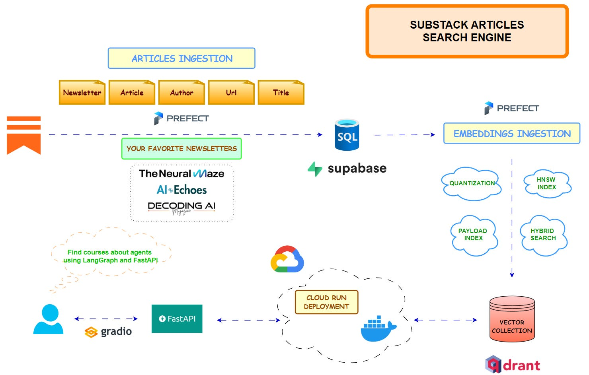

# Substack Articles Search Engine

<!-- Project Status -->

<!-- Providers -->

  <em>A RAG application for searching articles and getting answers on relevant topics from your favorite Substack newsletters</em>

## 📚 Table of Contents

- [Substack Articles Search Engine](#substack-articles-search-engine)
  - [📚 Table of Contents](#-table-of-contents)
  - [👤 Author](#-author)
  
## 👤 Author

**Silas Kwabla Gah** | ML Engineer

- 🔗 [LinkedIn](https://www.linkedin.com/in/silas-gah-46b126294)
- 🐙 [GitHub](https://github.com/silsgah)
- 📧 Email: gahsilas@gmail.com

---
🎯 Project Highlights
This is a full-stack, production-grade AI system that demonstrates:

✅ Complete ML Pipeline: From raw data ingestion to production deployment
✅ Advanced RAG Implementation: Query expansion, self-querying, and cross-encoder reranking
✅ Custom LLM Fine-Tuning: Supervised Fine-Tuning (SFT) + Direct Preference Optimization (DPO)
✅ Production Infrastructure: Microservices architecture with separate RAG and inference services
✅ Multi-Cloud Deployment: AWS SageMaker, RunPod, and Render.com support
✅ Full Observability: Experiment tracking (Comet ML) and prompt monitoring (Opik)
✅ Clean Architecture: Domain-Driven Design with ~6,000 lines of well-structured code
✅ CI/CD Pipeline: Automated testing, linting, and deployment workflows

